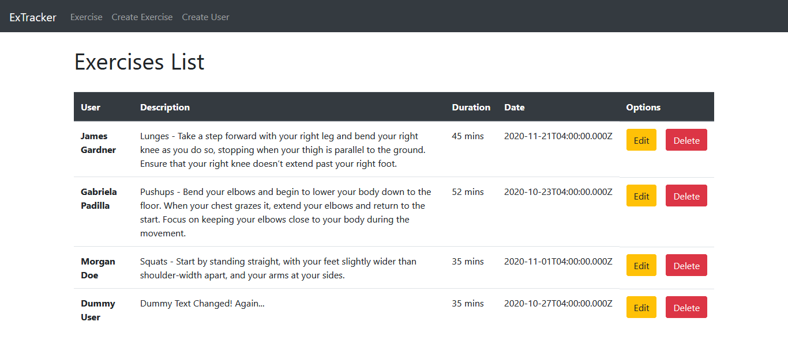

# ~ MERN Stack Application #1 - Exercise Tracker

[](https://nodesource.com/products/nsolid)

This is an exercise tracking application built with the MERN Stack technologies:
  - MongoDB
  - Express
  - React
  - NodeJS

# ~ Purpose Breakdown

> This is the first of many applications to tap into Full Stack Web Development. It's purpose was to learn the following techniques: 

- Handling Http get & post request to a database.
- Usage if tools such as **Postman** or **Insomnia** to test web APIs.
- Connecting to MongoDB's database & creating collections/documents.
- Create & Define models & routes for consuming a web API, defining the collections' structures & managing the CRUD operations with the database.

Current project status is: **Completed**.

# ~ Code Example

As an example of the project, Axios (a promise based http client for the browser & nodejs) was used to retrieve data from the database:
```sh
componentDidMount() {
    // port is 2200
    axios.get(`http://localhost:${port}/users/`).then((res) => {
      if (res.data.length > 0) {
        this.setState({
          users: res.data.map((user) => user.username),
          username: res.data[0].username,
        });
      }
    });
}
```
# ~ Project Preview: 


